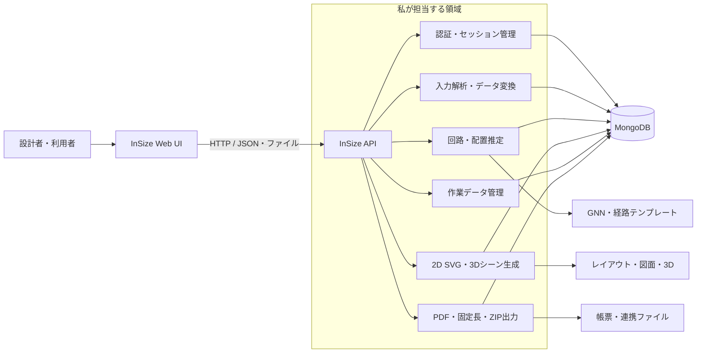
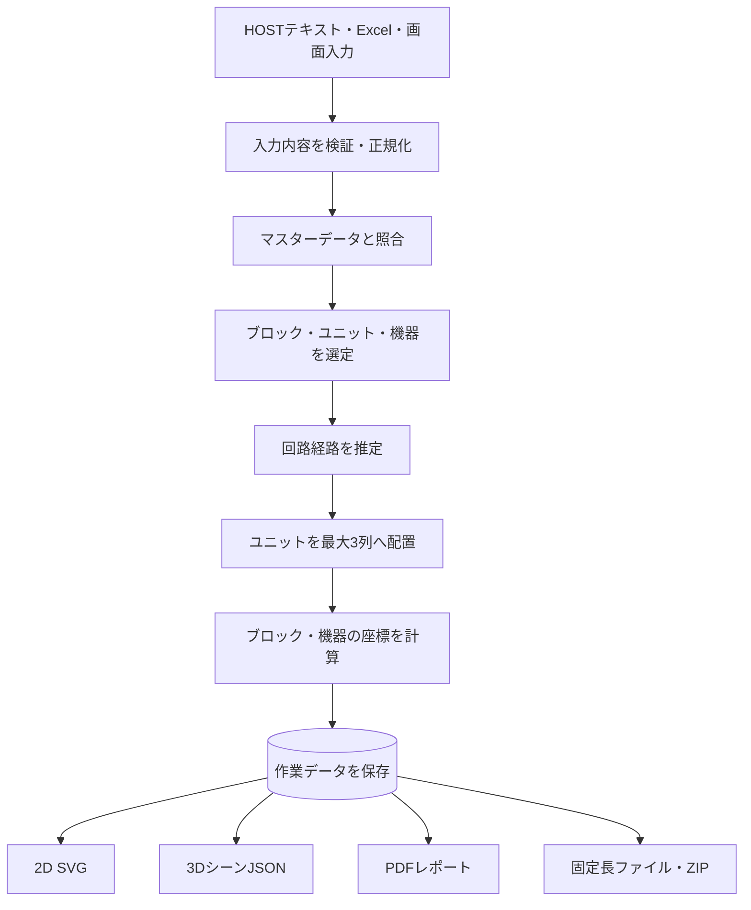
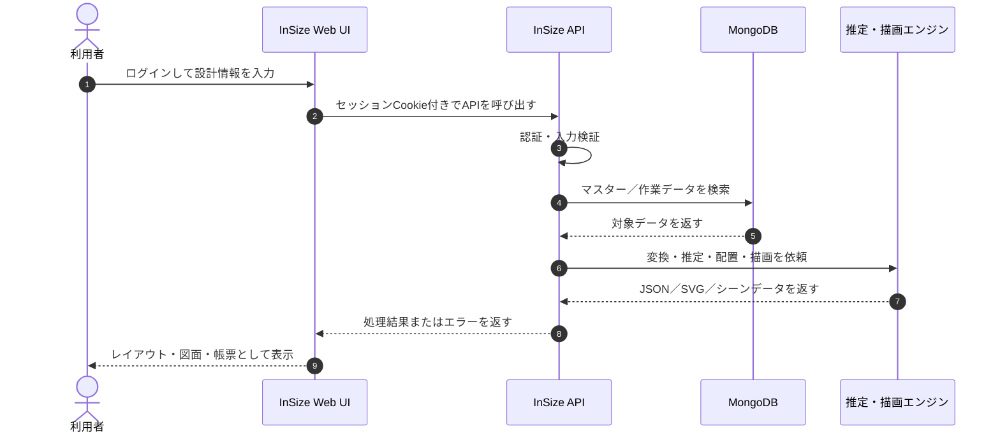
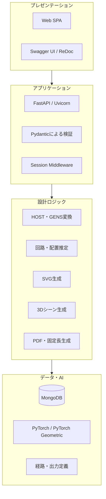

# はじめまして、InSize APIです

> **盤設計に必要な情報をつなぎ、回路・機器・ユニットのデータを、配置・図面・3D・帳票へ変換する設計支援APIサービスです。**

私は、盤設計の各工程で発生するデータを受け取り、マスターデータと照合しながら、次の工程で利用できる形へ整える **InSizeのバックエンドサービス** です。

単にデータを保存・検索するだけではありません。HOST由来テキストの構造化、回路経路の推定、ユニットの列配置、機器レイアウト、SVG図面、3Dシーン、PDF帳票、固定長データの生成まで、設計作業を一つの流れとして支援します。

---

## 私の役割

設計者、フロントエンド、マスターデータ、推定ロジック、出力機能の間に立ち、**「設計情報を使える成果物へ変換するハブ」** として働きます。

---

## 私にできること

### 1. 設計入力を構造化する

HOST見積もり画面のテキストやアップロードファイルを読み取り、ヘッダー、基本情報、盤情報、回路明細などを解析します。さらに、ブロック・サブユニット・ユニットなどのマスターを参照し、後続処理で扱えるJSONへ変換します。

- HOSTテキストをブロック／ユニット候補付きの作業JSONへ変換
- Excelから各種マスターデータをMongoDBへ登録
- GENS出力をInSize用JSONへ変換
- 設定値、選択肢、製品、画像、テンプレートなどを検索・提供

代表API: `POST /api/postBCSTXT2BlockJSON`, `POST /api/postGens2Json`, `POST /api/postExcel2Mongo`

### 2. 回路のつながりを推定する

機器やユニットの情報から、回路の接続関係をエッジとして組み立てます。用途に応じて、学習済みGNNモデルによる推定と、経路テンプレートによる決定的な推定を使い分けられます。

- ノード情報から回路エッジを推定
- パス単位で機器をまとめ、`IN` から `OUT` までの経路を生成
- 出次数制限や循環除去により、利用しやすい回路グラフへ整形
- 推定しきれない場合にも暫定経路を構成し、処理を継続

代表API: `POST /api/postFlowInfer`, `POST /api/postUnitFlow`

### 3. ユニットを配置列へ振り分ける

回路グラフとユニットの対応可能幅を受け取り、盤内の最大3列へユニットを振り分けます。経路の順序と幅候補の共通性を考慮し、配置工程で使える列構成を返します。

- `IN#n` から `OUT#n` までの経路を探索
- 長い経路を優先してユニットを整理
- ユニットの幅候補を比較して列を分割
- 列数が上限を超えた場合は、代表幅を基準に列を統合

代表API: `POST /api/postUnitLayoutInfer`, `POST /api/postUnits2Layout`

### 4. 機器・ブロックの配置を計算する

ユニット、ブロック、機器サイズ、配置方向などから座標を計算し、盤内レイアウトを組み立てます。

- 機器の縦置き／横置きに対応
- ブロック上の機器位置、占有スロット、反転情報を取得
- ユニット変更やブロック置換に対応
- 作業データからユニット・機器構成を再構築

代表API: `POST /api/postUnitDeviceByID`, `POST /api/postLineUp`, `POST /api/postReplaceBlock`, `POST /api/postWorkdataUnitDevice`

### 5. 設計結果を2D SVGにする

盤、列、ガター、ユニット、ブロック、機器をSVGとして描画します。画面表示用だけでなく、編集可能な結果図やユニット単体図の生成にも対応します。

- 盤全体のレイアウトSVGを生成
- 機器を含む詳細な箱図を生成
- ユニット単体のSVGを生成
- ブロック、機器、機器名などのSVG部品を個別生成
- 作業データを基に編集可能な2D結果図を生成

代表API: `POST /api/postBoxSvg4`, `POST /api/postLayoutSvg`, `POST /api/unit-svg/from-workdata`, `POST /api/mk_block`

### 6. 同じ設計を3Dシーンとして渡す

2Dレイアウトと互換性のある入力から、Three.jsなどで表示できる3DシーンJSONを生成します。盤、列、ガター、ユニット、ブロック、機器を直方体オブジェクトとして返します。

- 盤寸法とユニット奥行きをマスターから補完
- オブジェクトごとに位置、中心、幅・高さ・奥行き、材質情報を提供
- 盤、列、ユニット、ブロック、機器の出力有無を選択可能
- 既存の2D座標系と整合した3Dデータを提供

代表API: `POST /api/postBoxScene3d`

### 7. 作業データを保存し、設計の状態を管理する

ユーザーと図面番号を軸に作業データを管理し、編集中データの保存、検索、保管、削除を支援します。

- 作業中データをユーザー単位で保存
- ページング、絞り込み、並び替えによるデータ取得
- 作業データを保管データへ移動
- ステータス、担当者、作成・更新日時を保持

代表API: `POST /api/saveWork`, `POST /api/postWorkCollByPage`, `POST /api/postWork2Stored`, `POST /api/postWorkDelete`

### 8. 帳票・外部連携データを出力する

保存済みの設計データから、確認・提出・他システム連携に使える成果物を生成します。

- 設計結果とSVGを組み込んだPDFレポートを生成
- 定義マスターに従って固定長レコードを生成
- 複数の固定長ファイルをZIPとして提供
- 必要に応じてBase64付きJSONとして内容を返却

代表API: `GET /api/getResultPDF`, `POST /api/postFixedLenConvert`

---

## 設計データが成果物になるまで

この流れにより、入力形式や出力形式が異なっていても、設計情報を途中で分断せず、同じデータを基に複数の成果物を作れます。

---

## APIを呼び出したときの動き

---

## 私の強み

| 強み | 提供する価値 |
|---|---|
| 設計工程を横断するAPI群 | 入力、推定、配置、描画、保存、出力を一つのサービスでつなぎます。 |
| マスター連携 | 製品・ユニット・ブロック・機器の定義を再利用し、設計データの一貫性を支えます。 |
| 推定とルールの併用 | GNNによる推定と経路テンプレート／配置ルールを用途に応じて使い分けます。 |
| 2Dと3Dの両対応 | 同じレイアウト情報からSVGと3Dシーンを生成し、確認方法を広げます。 |
| 多様な入出力 | JSON、テキスト、Excel、SVG、PDF、固定長、ZIPを設計工程に合わせて扱います。 |
| 作業状態の継続管理 | ユーザー・図面番号単位で、編集中から保管までのデータを管理します。 |
| Web UIとの一体運用 | FastAPIからSPAとAPIを提供し、ブラウザ上の設計操作をバックエンドで支えます。 |

---

## 信頼して使っていただくために

私は、次の仕組みで安全性と扱いやすさを支えます。

- セッションベースのログイン認証
- 主要な設計APIに対するログイン確認
- Pydanticモデルによるリクエスト検証
- JSON形式に統一したHTTPエラー応答
- 認証済み利用者向けのSwagger UI／ReDoc
- ブラウザからのCookie送信を考慮したCORS設定
- 動的なAPIルーター登録による機能追加のしやすさ

> 認証要否、許可オリジン、Cookie属性などのセキュリティ設定は、実際の配備環境に合わせて構成する前提です。

---

## 技術プロフィール

---

## 私からのメッセージ

私は、設計者の判断を置き換えるためのシステムではありません。

入力の読み替え、候補の照合、回路の組み立て、配置計算、図面化、保存、帳票化といった反復作業を引き受け、**設計者が確認・判断・改善に集中できる状態をつくること** が私の役目です。

**「設計データを入れたら、次の工程でそのまま使える形になって返ってくる」——それが、InSize APIとして私が提供する価値です。**

---

_本書は、InSize APIの現行リポジトリに実装されている機能を基に作成したシステム紹介です。個別APIの厳密なリクエスト／レスポンス仕様は、稼働環境のOpenAPIドキュメントおよび各API仕様書を参照してください。_
