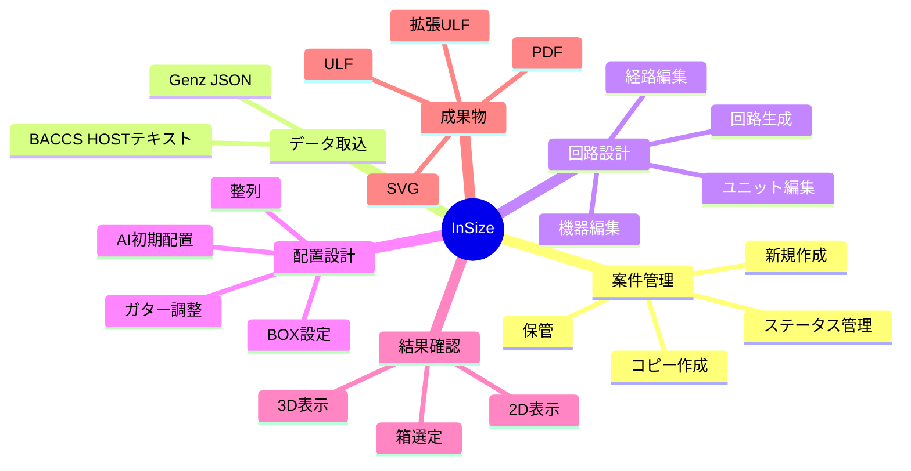
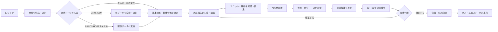
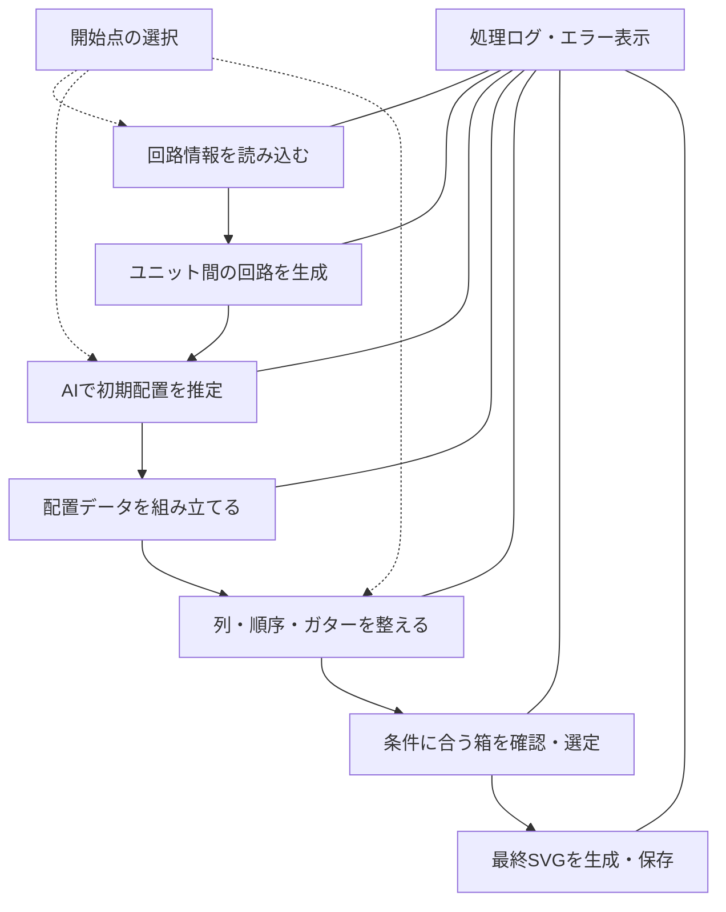
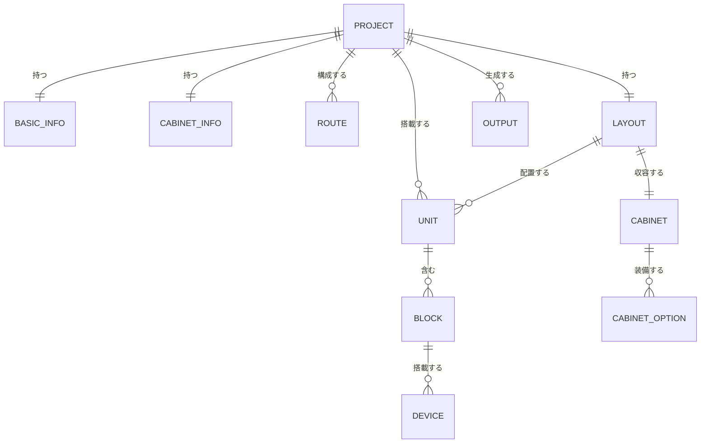

# はじめまして、InSizeです

> **配電盤の設計情報をつなぎ、回路・機器・筐体・配置を一つの案件として育てる設計支援システムです。**

私は **InSize（インサイズ）**。  
配電盤設計に必要な情報を取り込み、回路構成の検討、ユニットや機器の編集、盤内配置の生成・調整、筐体選定、2D／3Dでの確認、成果物の出力までを一つの流れで支援します。

私の役割は、設計者に代わってすべてを決めることではありません。情報を構造化し、計算や候補提示、可視化、データの受け渡しを担うことで、**設計者が判断すべきことに集中できる環境**をつくることです。

---

## 私が目指していること

配電盤設計では、案件情報、回路、ユニット、搭載機器、配線スペース、筐体寸法、配置結果など、多くの情報が相互に関係します。私は、それらを別々の資料として扱うのではなく、同じ案件データの中で関連づけます。

---

## 私にできること

### 1. 案件を整理し、設計の続きから始められます

- 案件を新規作成し、図面番号、件名、盤名称、担当者、更新日、進行ステータスを管理します。
- 既存案件をコピーし、類似案件を土台にして設計を始められます。
- 「設計中」「確認中」「承認待ち」「完了」などの状態で案件を見分けられます。
- ログインユーザーに紐づく案件を一覧化し、作業データを保管します。

### 2. 外部データを設計の入口にできます

- **Genz JSON**を読み込み、盤ごとのデータ、ユニット、経路を案件作成へつなげます。
- **BACCSのHOST見積もりテキスト**を読み込み、推定条件を指定して新しい図版データへ変換します。
- 盤単位で内容を確認してから案件化できるため、大きな入力データも段階的に扱えます。

### 3. 回路構成を「見て、触って、直せます」

- ユニットと入出力ノードの関係を回路図として可視化します。
- ブロック同士の結合・結合解除、経路追加、未使用経路の整理を支援します。
- マスターからユニットを検索・選択して追加できます。
- 回路図上のユニットから、所属ブロックと搭載機器へ掘り下げられます。
- 機器候補の検索、数量変更、転置、追加、削除を行い、ユニット構成へ反映します。

### 4. 盤内配置を生成し、設計者の意図で調整できます

- 回路情報から配置用データを組み立て、**AI初期配置**を実行できます。
- ユニットを列と順序に沿って整列し、盤内レイアウトを構成します。
- 入線・出線、列幅、配置高さ、上下ガターなどの配置条件を編集できます。
- 配置画面では、箱外形、列、ガター、ユニット、ブロック、機器を重ねて確認できます。
- 生成結果をそのまま固定せず、設計者が編集して再反映できます。

### 5. 設計結果を複数の視点で確認できます

- 最終配置を**2D**で確認できます。
- 箱外形、ユニット、ブロック、機器を**3D**で確認し、視点を動かして干渉や収まりを把握できます。
- 条件に合うキャビネット候補を検索・並び替えし、採用する箱を選定できます。
- キャビネット品名、内器高さ、入出線位置、主要仕様など、結果情報をまとめて確認できます。

### 6. 後工程で使える成果物へつなげます

- 盤内配置を表現する **SVG** を生成・保存します。
- **ULF**および**拡張ULF**を出力します。
- 設計結果の詳細を**PDF**で表示します。
- 設計中の構造化データと、人が確認する図面・帳票の両方を扱います。

---

## 私と進める標準的な設計フロー

この流れは一方向ではありません。結果を確認して違和感があれば、回路、機器、配置、筐体条件へ戻り、再生成・再調整できます。私は、**設計と確認の反復を一つの案件内で回せること**を大切にしています。

---

## 生成処理の中で私が行うこと

生成は、途中経過の見えない一回限りの処理ではありません。開始点を選び、各ステップの実行状況、成功件数、エラー内容を確認できます。

開始点は「回路生成から」「AI初期配置から」「整列配置から」選べます。すでに確定している工程を活かしながら、必要な部分だけを再実行できます。

---

## 私がつないでいる設計情報

| 情報領域 | 主な内容 | 設計での役割 |
|---|---|---|
| 基本情報 | 件名、図面番号、盤名称、地域、設備仕様、盤種類 | 案件と設計条件を特定 |
| 筐体情報 | 設置場所、用途、材質、構造、塗装色、寸法、入出線 | 箱・配置条件を定義 |
| 回路情報 | ノード、結線、経路 | 電気的なつながりを表現 |
| ユニット／機器 | ユニット、ブロック、機器、数量、方向 | 盤内に搭載する構成を定義 |
| 配置情報 | 列、順序、ガター、列幅、配置高さ | 盤内の物理的な収まりを表現 |
| 結果情報 | キャビネット、2D、3D、SVG、ULF、PDF | 確認・保存・後工程連携に使用 |

---

## 私の強み

### 設計情報を分断しません

回路だけ、配置だけ、帳票だけを扱うのではなく、案件情報から成果物までを関連づけます。ある場所で行った変更を後続工程へ反映しやすくし、情報の転記や見比べに伴う負担を減らします。

### 自動生成と手動調整を両立します

回路生成、AI初期配置、整列、箱候補の検索などで初期案づくりを支援しながら、設計者によるユニット、機器、ガター、BOX条件の編集も受け付けます。私は答えを押しつけるのではなく、**案を速く形にし、人の判断で仕上げる**ために働きます。

### 複雑な構成を視覚化します

回路図、配置SVG、2D、3Dという複数の表現を使い分けます。論理的な接続と物理的な収まりを別の視点から確認できるため、数値や一覧だけでは気づきにくい問題を見つけやすくします。

### 途中から再開・再実行できます

案件を保管して続きから作業でき、生成工程も任意の開始点から実行できます。設計変更のたびにすべてを最初からやり直す必要はありません。

### 結果を後工程へ渡せます

設計画面の中だけで完結せず、SVG、ULF、拡張ULF、PDFとして出力できます。確認用の見える成果と、後工程で利用するデータの両方を提供します。

---

## 設計者と私の役割分担

| InSizeが得意なこと | 設計者にお願いしたいこと |
|---|---|
| データの取込・変換・構造化 | 入力データと設計条件の妥当性確認 |
| 回路・配置の初期案生成 | 電気的・機械的な設計判断 |
| 候補検索、整列、再計算 | 採用する機器・筐体・配置の決定 |
| 回路図、2D、3Dによる可視化 | 安全性、規格、製造性、保守性の最終確認 |
| 案件保管と成果物出力 | 承認、確定、後工程への正式な引き渡し |

> **私は設計判断を支援しますが、設計者の確認と承認に代わるものではありません。**  
> 特に、生成結果、機器構成、配線スペース、筐体寸法、規格適合性は、成果物を確定する前に必ず確認してください。

---

## 安心して使っていただくために

- ログインセッションを確認し、ユーザー単位で案件を扱います。
- 一般ユーザーと特権ユーザーの区分に応じて、保管やステータス変更の可否を制御します。
- 削除など影響の大きい操作では確認画面を表示します。
- 生成処理では経過ログとエラーを表示し、問題が起きた工程を追いやすくします。
- 原図やBACCSデータを案件化する前に、変換内容や対象盤を確認できます。

---

## 私からのメッセージ

私は、配電盤設計を「複数の資料と個別作業の集合」から、**つながった設計プロセス**へ変えるためのシステムです。

データを受け取り、構成を組み立て、形にし、見せ、直し、残し、次へ渡す。  
その一連の流れを支えることで、設計のスピードだけでなく、確認のしやすさ、情報の一貫性、再利用性の向上にも貢献します。

> **回路から配置へ、配置から成果物へ。**  
> **配電盤設計の流れを、InSizeが一つにつなぎます。**

---

*本書は、InSizeの現行画面・操作説明・実装仕様をもとに、システム目線で機能と提供価値を紹介するために作成した文書です。*
