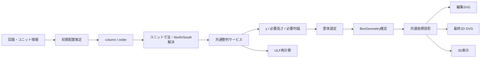

# 回路・配置生成／配置編集 共通座標設計

作成日: 2026-07-28

## 1. 結論

配置データの主情報を `x, y` にせず、次の2項目に変更する。

- `column`: 配置列（1〜3）
- `order`: 列内の並び順（0開始）

`x` と `y` は配置結果から求める派生値とする。

- `x`: 選択済み筐体とユニット幅から求める表示用座標
- `y`: `order`、ユニット高さ、North/South、筐体上ガターから求める配置結果

ドラッグ操作では生の `x, y` を保存せず、移動先の `column` と `order` を決定してから全体を再整列する。

## 2. 現在の問題

現在の `layout.layout[].x` には、処理経路によって異なる値が入る。

| 処理 | 現在の `x` の意味 |
| --- | --- |
| `postUnits2Layout` | 全ユニット `0` |
| `postBoxSvg` | 左ガターを含む列左端 |
| `UnitAligner` / `postLineUp` | ガターを除いた列幅の累積値 |
| `postBoxSvg2 result2d` | `x` を描画に使わず、`c` から表示Xを再計算 |
| `postBoxSvg4` | `x` を描画に使わず、`c` から表示Xを再計算 |
| `postBoxScene3d` | `x` を描画に使わず、`c` から表示Xを再計算 |
| 配置編集 | SVG上の物理Xをドラッグ座標として取得 |

このため、同じ `x=650` でも「第3列の論理位置」「第2列の右端」「筐体内の物理位置」のいずれにも解釈される。

また、現在の `UnitAligner` は `x` から列を推測している。第3列のXが第2列の右端と一致した場合、第2列と第3列を同じ列に分類する境界問題がある。

生成処理では配置編集用の一時補正を通らず、同じ境界問題が再発する。

## 3. 座標系

### 3.1 Box座標

結果2D、3D、最終SVGで使用する物理座標。

- 原点: 筐体外形の左上
- X正方向: 右
- Y正方向: 下
- 単位: mm
- 左右ガター、列間ガターを含む

### 3.2 配置座標

配置ロジックが扱う論理情報。

```json
{
  "column": 1,
  "order": 0
}
```

列判定や並び順判定に `x, y` を使用しない。

### 3.3 表示座標

Box座標へ投影した結果。

```text
columnLeft(1) = leftGutter
columnLeft(2) = leftGutter + floor1 + centerLeftGutter
columnLeft(3) = leftGutter + floor1 + centerLeftGutter
                + floor2 + centerRightGutter

renderX = columnLeft(column)
          + (floorWidth(column) - unitWidth) / 2
```

`renderX` はSVG、2D、3Dで共通の計算とする。

## 4. 縦方向の整列規則

ユニット固有ガターを次の名称で扱う。

- `north`: ユニット上側の必要クリアランス（現行 `gtop`）
- `south`: ユニット下側の必要クリアランス（現行 `gbottom`）

筐体側は次の名称とする。

- `boxTop[column]`: 列ごとの上側クリアランス（現行 `boxg`）
- `boxBottom`: 下側クリアランス（現行 `boxgb`）

整列式は次のとおり。

```text
先頭:
y[0] = max(boxTop[column], north[0])

2台目以降:
y[n] = y[n-1] + height[n-1]
       + max(south[n-1], north[n])

必要筐体高さ:
requiredHeight =
  last.y + last.height + max(last.south, boxBottom)
```

NorthとSouthは加算せず、大きい方を必要クリアランスとして使用する。

## 5. 正規レイアウトモデル

新形式は `layout_version: 2` とする。

```json
{
  "layout_version": 2,
  "units": [
    {
      "i": "10001",
      "u": "UPN10-10",
      "k": "UPN10_10_1",
      "column": 1,
      "order": 0,
      "width": 400,
      "height": 400,
      "north": 150,
      "south": 0,
      "allowed_widths": [400, 500],
      "allowed_depths": [99],
      "y": 150
    }
  ]
}
```

### 主情報

- `i`
- `u`
- `k`
- `column`
- `order`
- `width`
- `height`
- `north`
- `south`
- `allowed_widths`
- `allowed_depths`

### 派生情報

- `y`
- `requiredHeight`
- `renderX`
- `renderY`
- 実際のユニット間ガター
- ULF

### 互換項目

既存保存データとの互換用に以下を当面維持する。

| 現行 | v2 |
| --- | --- |
| `c` | `column` |
| `gtop` | `north` |
| `gbottom` | `south` |
| `w` | `width` |
| `h` | `height` |
| `list_w` | `allowed_widths` |
| `list_d` | `allowed_depths` |

`x` は互換出力として残してもよいが、列判定、並び順、保存後の再構築には使用しない。

## 6. 処理フロー



### 重要な分離

- `postUnits2Layout` はユニット識別子、列、順序の生成だけを担当する。
- 整列サービスだけが `y` と必要高さを計算する。
- SVG生成APIは配置データを変更しない。
- SVG生成APIは描画だけを担当する。
- 筐体選定後のX投影は共通 `BoxGeometry` で行う。

## 7. 配置編集

### 7.1 ドラッグ中

SVGの `renderX`, `renderY` を使って追従表示する。

この座標はプレビュー専用とし、`layout.layout` へ保存しない。

### 7.2 ドロップ時

1. ポインタXと列領域から `targetColumn` を決める。
2. 対象列のユニット中心Yと比較して `targetIndex` を決める。
3. 移動対象を旧列から取り除く。
4. 新列の `targetIndex` へ挿入する。
5. 各列の `order` を0から振り直す。
6. 整列APIへ `column / order` を送る。
7. 返却された `y` でSVGを再描画する。

送信する移動情報の例:

```json
{
  "unit_i": "10001",
  "target_column": 3,
  "target_index": 1
}
```

生のドラッグ終了 `x, y` は整列APIへ送らない。

## 8. API変更仕様

### 8.1 `postLineUp`

後方互換のため任意項目を追加する。

```json
{
  "coordinate_mode": "column-order-v2",
  "l": []
}
```

| `coordinate_mode` | 動作 |
| --- | --- |
| 未指定 / `legacy-x` | 現行処理 |
| `column-order-v2` | `column / order` で整列 |

v2では以下を禁止する。

- `x` からの列推測
- `y` の大小だけによる恒久的な順序決定
- SVG座標から配置データを復元

### 8.2 v2レスポンス

```json
{
  "layout_version": 2,
  "units": [],
  "required_height": 1400,
  "column_width_candidates": {
    "1": [400, 500],
    "2": [250],
    "3": [500]
  },
  "errors": []
}
```

整列不能時は `h=9999` の番兵値ではなく、エラーコードを返す。

```json
{
  "errors": [
    {
      "code": "NO_COMMON_WIDTH",
      "column": 2,
      "unit_ids": ["10001", "10004"]
    }
  ]
}
```

### 8.3 SVG API

`postBoxSvg2`、`postBoxSvg4`、`postBoxScene3d` は同じ座標投影サービスを利用する。

SVGのユニット要素には次を出力する。

```xml
<g
  data-unit-i="10001"
  data-column="1"
  data-order="0"
  data-render-x="100"
  data-render-y="150"
  transform="translate(100,150)"
>
```

`data-layout-x` は廃止候補とし、互換期間中だけ出力する。

## 9. クライアント状態

`layout.layout` の更新は一括トランザクションとする。

- 整列成功時だけ全ユニットを置き換える。
- 整列失敗時はドラッグ前の `column / order` を保持する。
- 手動の未整列 `x, y` を保存しない。
- `反映` 後に `generationStartStep = "lineUp"` として再度同じ整列を実行する必要はない。
- 保存済み正規レイアウトを後続生成処理がそのまま使用する。

## 10. ULF

ULFは配置入力と保存済み配置の両方を兼ねない。

- 初期配置推定結果: `column / order` を作る入力
- 最終ULF: 整列後の `y` と筐体高さから作る出力

最終ULFの実ガターは次で求める。

```text
topGap = first.y
middleGap = lower.y - (upper.y + upper.height)
bottomGap = box.height - (last.y + last.height)
```

ULFからレイアウトを再構築する場合も、ULF配列順を `order` として復元し、ガタートークンを `x` や列判定に使用しない。

## 11. 変更対象

### バックエンド

- `services/UnitAligner.py`
  - `align_by_column_order` を追加
  - 現行 `align` は互換用として維持
- `api/postLineUp.py`
  - `coordinate_mode` とv2レスポンスを追加
- `api/postUnit2Layout.py`
  - `column / order` を返す
  - 初期 `x=0`, 全体通算 `y` の生成を廃止
- `api/postBoxSvg.py`
  - 座標同期処理を廃止
  - 互換モードのみ現行動作を維持
- `services/EditableResult2dSvgCreator.py`
- `services/SVGCREATOR2.py`
- `services/box_scene3d.py`
  - 共通 `BoxGeometry` を使用

### クライアント

- `GenerationRunnerPage.tsx`
  - 生成フローを `column/order → align → box → render` に変更
- `LayoutEditDialog.tsx`
  - ドロップ結果を `column/order` として送信
  - 一時的なX境界補正を削除
- `useAppStore.ts`
  - v2型を追加
- `LayoutDesignTab.tsx`
  - North/South表示は正規モデルから取得

## 12. 移行手順

### Phase 1: 整列APIのv2追加

- 現行APIの既定動作は変更しない。
- `column-order-v2` を追加する。
- 生成画面と配置編集画面の両方をv2へ切り替える。
- クライアントのX境界補正を削除する。

### Phase 2: 生成フロー整理

- `postBoxSvg` による座標同期を廃止する。
- `postUnits2Layout` は `column/order` だけを生成する。
- SVG生成を純粋な描画処理にする。

### Phase 3: 描画座標共通化

- `BoxGeometry` を共通サービス化する。
- 編集SVG、最終2D、3DのX投影を統一する。

### Phase 4: 保存形式v2

- 新規保存は `layout_version: 2` とする。
- 読込時に旧形式をv2へ変換する。
- 旧APIと旧 `x` 推測処理は移行完了後に廃止する。

## 13. テスト条件

最低限、次を自動テストする。

1. 1〜3列すべてにユニットがある。
2. 第3列の位置が第2列右端と一致しても混同しない。
3. 同一ユニット番号が複数存在する。
4. `north > south`、`south > north` の両方。
5. 各列で異なる上ガターを使用する。
6. 列移動と同一列内の並べ替え。
7. 同じYへドロップしても `order` が一意に決まる。
8. 共通幅、共通奥行きが存在しない場合の構造化エラー。
9. 旧保存データの読込互換。
10. 編集SVG、最終2D、3Dでユニット原点が一致する。

## 14. 当面の扱い

現在クライアントに入っている第3列Xの微小補正は暫定対応とする。

この補正を回路・配置生成へ横展開するのではなく、Phase 1で `column-order-v2` へ切り替えた時点で削除する。
